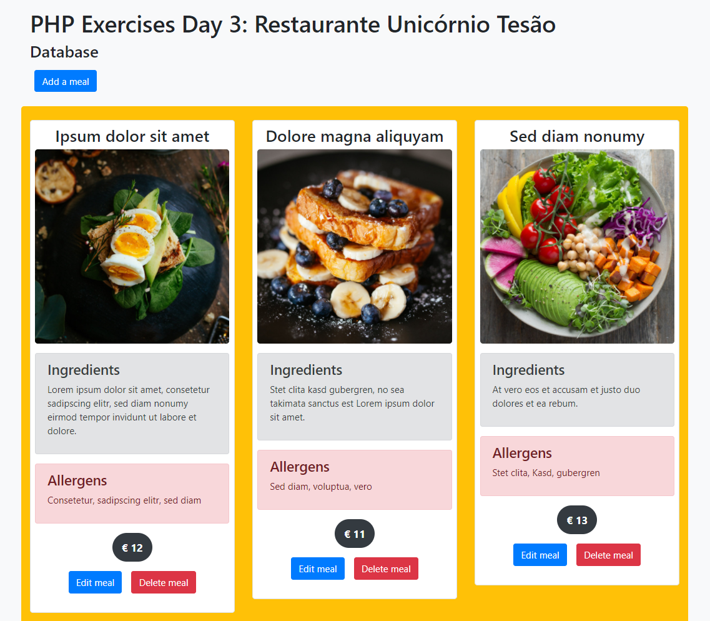
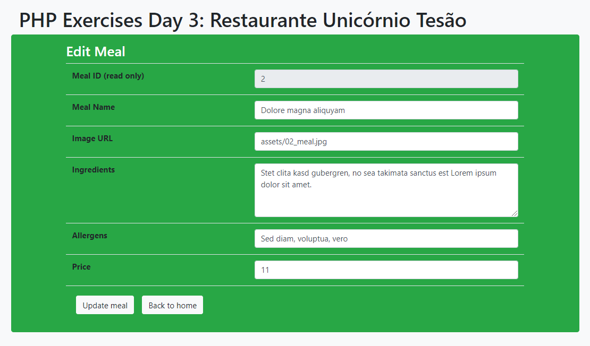

# PHP Exercises 3

This is a small project demonstrating a restaurant's meal database or simply online cookbook. It uses XAMPP with a very small MySQL DB.

The database only contains one table with the __image URL__, the __meal's name__, __price__, __ingredients__, __allergens__ and __id__.

The UI has the following features:
- Display all meals
- Create a new meal
- Edit an existing meal
- Delete a meal

